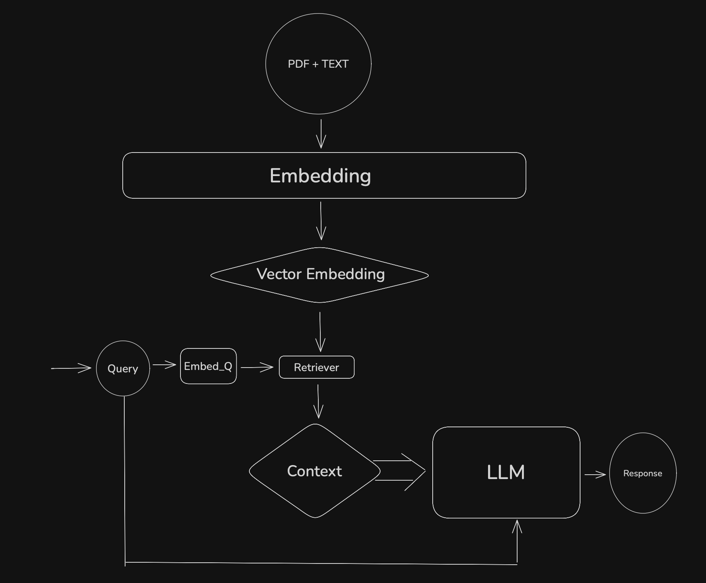
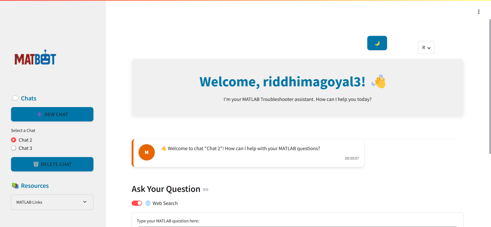
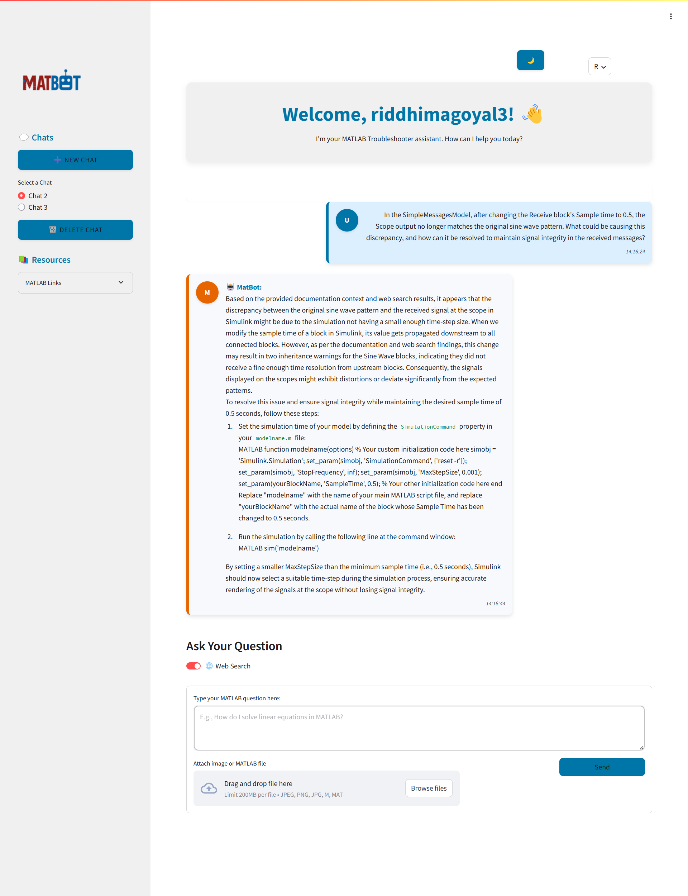

# 🤖 MATBOT

## SUMMARY 
*MATBOT* is an AI-powered *MATLAB troubleshooter* with a simple *Streamlit* interface. It uses *Retrieval-Augmented Generation (RAG)* to provide accurate, context-aware answers to MATLAB-related queries. Users can input both text and images, making it easier to debug code or share error screenshots. Powered by tools like *LangChain, HuggingFace, and ChromaDB*, MATBOT retrieves relevant information from documentation and generates helpful responses—making it a quick and intelligent assistant for learning and troubleshooting MATLAB.

## 🔧 Features
- 💬 *Interactive UI* built using *Streamlit* for a chat-based experience.

- 🔍 *Context-aware* responses powered by LangChain and Chroma vector store.

- 🧠 Deep Learning Support using *HuggingFace Transformers and PyTorch.*

- 🧪 Uses *RAG* (Retrieval-Augmented Generation) for precise and relevant answers.

- 📚 Integrates Wikipedia and *web search* via Tavily for enhanced context.

- 🧮 Calculates confidence with *cosine similarity* from sklearn.metrics.pairwise.

## 🛠 Tech Stack
- 🐍 *Python :*  The core programming language used for MATBOT. Python is ideal for AI/ML projects because of its rich ecosystem of libraries and frameworks.
#####

- 🧠 *LangChain :*  LangChain helps structure and manage RAG (Retrieval-Augmented Generation) pipelines. It allows you to combine LLMs with external sources like vector databases, tools, or APIs .
#####

- 🤗 *HuggingFace Transformers :* This library is used to load and run powerful pretrained language models (like Mistral-7B) and embedding models (like BAAI/bge). 
#####

- 🗃 *Chroma (Vector Store) :* Chroma is a vector database where the project stores document embeddings. 
#####

- 🔥 *PyTorch :* PyTorch is the underlying deep learning framework used to run the Mistral-7B model and the embedding model on the GPU.
#####
- 📊 *scikit-learn :* Used for computing cosine similarity between the query vector and document vectors and helps determine the confidence score .
#####

- 🌐 *Streamlit :* A Python-based web framework for building interactive user interfaces. Streamlit is used to build the frontend of MATBOT where users can enter queries and view responses easily.
#####

- 🔍 *Tavily API :* Used to pull real-time web search results when the internal documentation is insufficient. 

## 🚀 How It Works

- User inputs a MATLAB-related question via the Streamlit UI.

- The query is embedded and compared against a preloaded document database using Chroma.

- If needed, it fetches additional context from Wikipedia and the web.

- A well-structured prompt is created and sent to a language model (e.g., Mistral or similar).

- The model generates a step-by-step, technically accurate response.

## 🚀 How It Runs
#### *✅ 1. Create a .env File*
A .env file is used to store environment variables, such as API keys, secrets, and configuration settings. Here's how to create and use one:

- *🔧 Step 1*: Create the .env file in the root directory of your project (same location as requirements.txt), create a file named:

.env

- 📄 *Step 2:* Add your environment variables
Here’s an example of what the .env file might look like:

bash
OPENAI_API_KEY=your_openai_api_key_here
GOOGLE_API_KEY=your_google_api_key_here
DATABASE_URL=your_database_url_here

🔒 Important: Never commit this file to version control (like GitHub). Add .env to your .gitignore file.

#### *✅ 2. Install Python Dependencies**
Make sure Python and pip are installed.

- *🐍 Step 1:* Create and activate a virtual environment (recommended)

##### Create virtual environment

python -m venv Matrag

##### Activate it (Windows)

Matrag\Scripts\activate

##### Activate it (macOS/Linux)

source Matrag/bin/activate

- *📦 Step 2:* Install the required packages

pip install -r requirements.txt

#### *✅ 3. Run the Streamlit App*
Once everything is installed and .env is configured:

streamlit run app.py

This will open your app in the browser at http://localhost:8501/ by default.

## 🌐 Deployment
The MATBOT website is live and replicates the ChatGPT experience. Users can chat with the bot and receive MATLAB troubleshooting advice in real time.

## 🎨 Design Choices 
- *Lightweight Frontend:* Streamlit was chosen for its rapid prototyping capability and ease of use.

- *Model Selection:* Mistral-7B was selected for its balance between performance and resource efficiency. BAAI/bge embeddings proved to be robust in capturing query-document similarity.

- *Chroma DB:* Enabled scalable, low-latency retrieval across varied documentation sets.

- *Fallback Strategy:* Tavily API ensures broader coverage by pulling from real-time web data.

<!-- ## 🧪Results:

- Achieved 85–90% accuracy on internal benchmarks.

- Average response latency ~2.5–3 seconds.

- Positive feedback in pilot tests with MATLAB users (both students and researchers). -->

   

## 📁 Project Structure

*MATBOT/*
├── data
├── mat
├── MatBot
├── .env
├── .gitignore
├──README.md
└── req.txt
